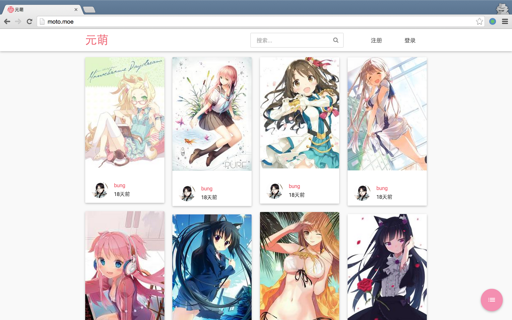

# 元萌 [](https://travis-ci.org/bung87/moto-moe)
  
## System Requirements
* Python version >= 3
* [lxml](http://lxml.de/installation.html)
* Redis-server
* Mysql

## Installation
```
    sudo apt-get install python3-lxml
    pip install git+https://github.com/bung87/moto-moe 
    pip install -r https://raw.githubusercontent.com/bung87/moto-moe/master/dependency_links.txt
    cd `<installation_location>` && npm install && bower install

```
## Data migration 
```
    ${VIRTUAL_ENV}/bin/django-admin syncdb
    ${VIRTUAL_ENV}/bin/django-admin migrate
```
## Development
```
    git clone git@github.com:bung87/moto-moe.git
    pip install -r requirements.txt && pip install -r dependency_links.txt
    #follow Data migration 
    python moto/manage.py runserver
    npm install && bower install
    grunt #build static files

```
## Deployment
    # use grunt building static files 
    export DJANGO_SETTINGS_MODULE='your_package.settings_module'
    #follow Data migration 
    ${VIRTUAL_ENV}/bin/django-admin collectstatic #collect static files to assets directory
    gunicorn moto.moe.wsgi:application -c `<your_gunicorn_configuration_directory>`gunicorn_conf.py

## Packaging
    python setup.py sdist

## Search Index

```
    ${VIRTUAL_ENV}/bin/django-admin rqworker
```

## License
The MIT License (MIT)

Copyright (c) 2015 Bung

Permission is hereby granted, free of charge, to any person obtaining a copy
of this software and associated documentation files (the "Software"), to deal
in the Software without restriction, including without limitation the rights
to use, copy, modify, merge, publish, distribute, sublicense, and/or sell
copies of the Software, and to permit persons to whom the Software is
furnished to do so, subject to the following conditions:

The above copyright notice and this permission notice shall be included in all
copies or substantial portions of the Software.

THE SOFTWARE IS PROVIDED "AS IS", WITHOUT WARRANTY OF ANY KIND, EXPRESS OR
IMPLIED, INCLUDING BUT NOT LIMITED TO THE WARRANTIES OF MERCHANTABILITY,
FITNESS FOR A PARTICULAR PURPOSE AND NONINFRINGEMENT. IN NO EVENT SHALL THE
AUTHORS OR COPYRIGHT HOLDERS BE LIABLE FOR ANY CLAIM, DAMAGES OR OTHER
LIABILITY, WHETHER IN AN ACTION OF CONTRACT, TORT OR OTHERWISE, ARISING FROM,
OUT OF OR IN CONNECTION WITH THE SOFTWARE OR THE USE OR OTHER DEALINGS IN THE
SOFTWARE.
